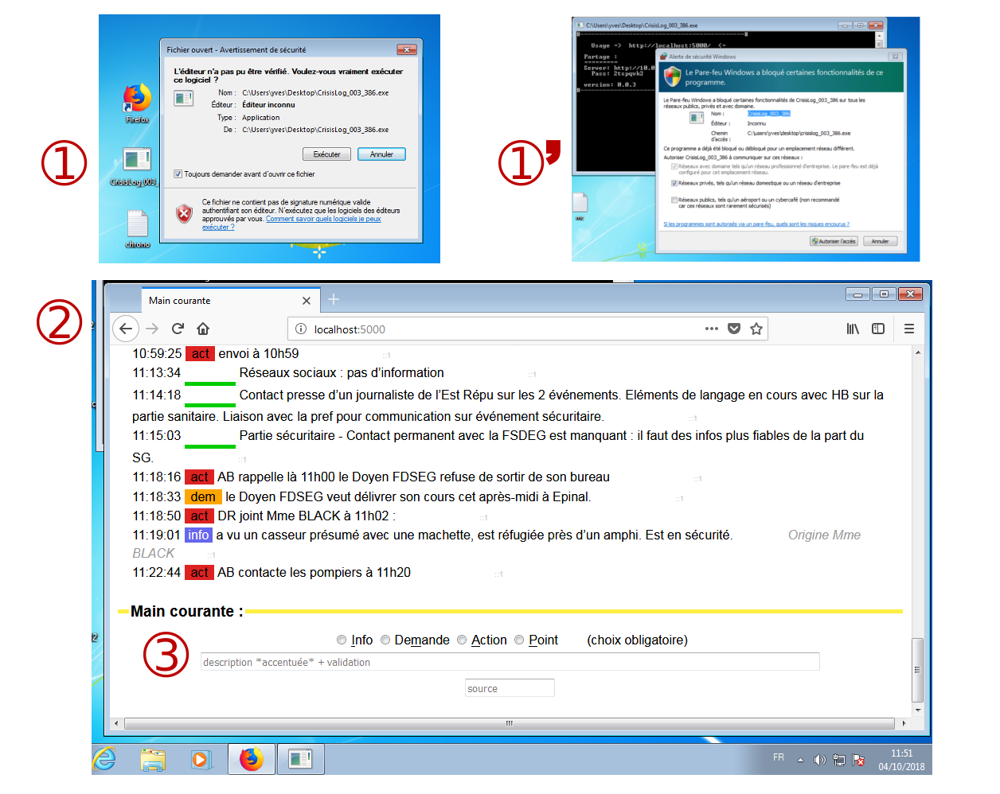

CrisisLog
=============


[](https://goreportcard.com/report/github.com/yvesago/CrisisLog)
[](https://travis-ci.org/yvesago/CrisisLog)
[](https://coveralls.io/github/yvesago/CrisisLog)


Statut: travail en cours


# Description

``CrisisLog`` est une application multi-os (Windows, macOS, Linux) pour gérer la saisie de la «main courante» lors d'une situation de crise.

``CrisisLog`` permet d'améliorer la lecture de la main courante en précisant si l'évènement à enregistrer concerne une information, une demande, une action ou un point de situation (cf: image **(3)**).


``CrisisLog`` génère un fichier ``chrono.log`` dans le dossier courant. C'est un simple fichier texte.


Exemple lors d'un exercice de crise:




# Fonctionnalités

``CrisisLog`` est un binaire statique qui contient un serveur web local ainsi que les composants web. Un simple navigateur web standard est suffisant pour l'utiliser **(2)**.

L'usage d'un serveur web local permet de partager l'affichage et la saisie, sur un réseau local.


# Usage

Il suffit de lancer l'exécutable puis de se connecter avec un navigateur à l'url par défaut : ``http://localhost:5000``

Un menu permet d'afficher l'adresse IP et le mot de passe nécessaire à un accès partagé.

Le fichier ``chrono.log`` du dossier courant peut être conservé comme élément de preuve.


# Construction

La construction de l'application nécessite l'usage d'un compilateur [Go](https://golang.org/)

### Pré-requis


```bash
$ git clone https://github.com/yvesago/CrisisLog.git
$ cd CrisisLog/

$ go get -u github.com/jteeuwen/go-bindata/...

$ go get github.com/gin-gonic/gin
$ go get gopkg.in/olahol/melody.v1

```


### Construction

L'utilitaire ``go-bindata`` permet de générer le code qui embarque les éléments html.
```
$ go-bindata -o myweb.go web/*

$ go test

```

puis, en fonction de la cible choisie:

```

$ GOOS=windows GOARCH=386 go build  -ldflags "-s -X main.version=0.0.1" -o CrisisLog_001_386.exe

$ GOOS=windows GOARCH=amd64 go build  -ldflags "-s -X main.version=0.0.1" -o CrisisLog_001_amd64.exe

$ GOOS=darwin GOARCH=amd64 go build  -ldflags "-s -X main.version=0.0.1" -o CrisisLog_001_darwin_amd64

$ GOOS=linux GOARCH=amd64 go build  -ldflags "-s -X main.version=0.0.1" -o CrisisLog_001_linux_amd64

$ GOOS=linux GOARCH=386 go build  -ldflags "-s -X main.version=0.0.1" -o CrisisLog_001_linux_386

```


## Limitations

- Pour windows: le binaire n'est pas signé et demande une autorisation d'exécution **(1)**.
- Pour windows: une demande d'accès réseau doit être validée pour autoriser les accès partagés **(1')**.
- Tous OS: la communication entre le serveur et le navigateur n'est pas chiffrée. L'usage doit alors être limité à un réseau local de confiance.


## Voir également

- [CrisisBoard](https://github.com/yvesago/CrisisBoard)
- [CrisisMgmt](https://github.com/yvesago/CrisisMgmt)


## Licence

GPLv3 License

Copyright (c) 2017, 2018 Yves Agostini


